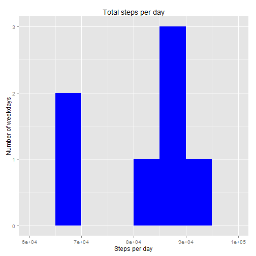
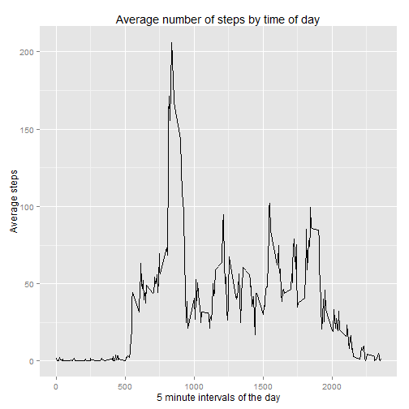
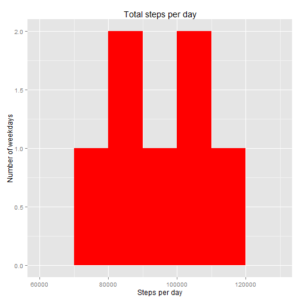
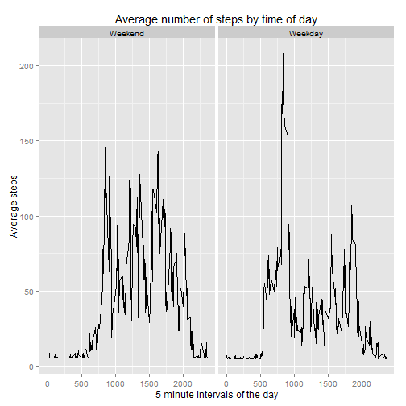

## Loading and preprocessing the data
Load the course data into the working directory

```r
setwd("C:/Users/Ian/Documents/DataScience/ReproResearch/RepData_PeerAssessment1")
```

Unzip the file, load the data into memory and convert the "date" variable to a date class


```r
unzip("./activity.zip", exdir="./data")
activity<-read.csv("./data/activity.csv")
activity$date<-as.Date(activity$date)
```


## What is mean total number of steps taken per day?


```r
activity$weekday<-weekdays(activity$date)
activityGrp<-with(activity,aggregate(steps~weekday,FUN="sum", na.rm=T))
```

Histogram of total number of steps per day.  

```r
library(ggplot2)

ggplot(activityGrp,aes(steps)) +
    geom_histogram(fill="blue", binwidth=5000) + 
    labs(title="Total steps per day") +
    labs(x="Steps per day") +
    labs(y="Number of weekdays")
```

 

Mean number of steps per day

```r
with(activity,aggregate(steps~weekday,FUN="mean", na.rm=T))
```

```
##     weekday    steps
## 1    Friday 42.91567
## 2    Monday 34.63492
## 3  Saturday 43.52579
## 4    Sunday 42.63095
## 5  Thursday 28.51649
## 6   Tuesday 31.07485
## 7 Wednesday 40.94010
```
Median number of steps per day

```r
with(activity,aggregate(steps~weekday,FUN="median", na.rm=T))
```

```
##     weekday steps
## 1    Friday     0
## 2    Monday     0
## 3  Saturday     0
## 4    Sunday     0
## 5  Thursday     0
## 6   Tuesday     0
## 7 Wednesday     0
```

## What is the average daily activity pattern?


```r
library(dplyr)
activity_grp<-group_by(activity, interval)
avgSteps<-summarise(activity_grp,avgSteps=mean(steps, na.rm=T))
ggplot(avgSteps,aes(x=interval,y=avgSteps,)) + 
    geom_line() +
    labs(title="Average number of steps by time of day") +
    labs(x="5 minute intervals of the day") +
    labs(y="Average steps")
```

 

```r
maxInterval<-avgSteps[avgSteps$avgSteps == max(avgSteps$avgSteps),1]
```
Interval 835 is the interval with the largest average number of steps

## Imputing missing values

```r
missing<-sum(is.na(activity$steps))
```
There are 2304 missing values of the variable steps in the data set

Generate means for each day and use them to replace missing values

```r
actDayMean<-with(activity,aggregate(steps~weekday,FUN="mean", na.rm=T))
index<-which(activity$weekday %in% actDayMean$weekday & is.na(activity$steps))

imputedAct<-activity

for (i in index){
    imputedAct$steps[i]<-actDayMean$steps[actDayMean$weekday == imputedAct$weekday[i]]
    }
```

Histogram of total number of steps per day.  

```r
imputedActGrp<-with(imputedAct,aggregate(steps~weekday,FUN="sum", na.rm=T))

library(ggplot2)

ggplot(imputedActGrp,aes(steps)) +
    geom_histogram(fill="red", binwidth=10000) + 
    labs(title="Total steps per day") +
    labs(x="Steps per day") +
    labs(y="Number of weekdays")
```

 

Mean number of steps per day using the imputed data set

```r
with(imputedAct,aggregate(steps~weekday,FUN="mean", na.rm=T))
```

```
##     weekday    steps
## 1    Friday 42.91567
## 2    Monday 34.63492
## 3  Saturday 43.52579
## 4    Sunday 42.63095
## 5  Thursday 28.51649
## 6   Tuesday 31.07485
## 7 Wednesday 40.94010
```
The mean number of steps per day are unchanged using the imputed data set.This is what 
we would expect given the imputation method used.

Median number of steps per day using the imputed data set

```r
with(imputedAct,aggregate(steps~weekday,FUN="median", na.rm=T))
```

```
##     weekday steps
## 1    Friday     0
## 2    Monday     0
## 3  Saturday     0
## 4    Sunday     0
## 5  Thursday     0
## 6   Tuesday     0
## 7 Wednesday     0
```
The median number of steps per day is unchanged using the imputed data set.


## Are there differences in activity patterns between weekdays and weekends?

```r
imputedAct$weekdayEnd[imputedAct$weekday %in% c("Sunday", "Saturday")]<-"Weekend"
imputedAct$weekdayEnd[imputedAct$weekday %in% c("Monday", "Tuesday", "Wednesday", "Thursday","Friday")]<-"Weekday"
imputedAct$weekdayEnd<-factor(imputedAct$weekdayEnd,levels=c("Weekend","Weekday"))

imputedAct_grp<-group_by(imputedAct, weekdayEnd,interval)
imputedavgSteps<-summarise(imputedAct_grp,avgSteps=mean(steps))
ggplot(imputedavgSteps,aes(x=interval,y=avgSteps,)) + 
    geom_line() +
    facet_grid(.~weekdayEnd) +
    labs(title="Average number of steps by time of day") +
    labs(x="5 minute intervals of the day") +
    labs(y="Average steps")
```

 
The average number of steps taken on weekdays peaks higher than the average
number of steps taken at the weekend. It looks like the peak on weekdays is 
associated with travel to work. Overall the average number of steps taken at the 
weekend appears to be higher than the average number of steps taken during the week. 
This could be due to more time being available for recreation at the weekend.
